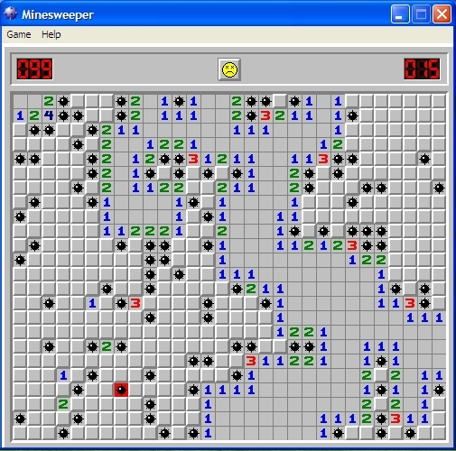

<!--
<head>
<link rel="stylesheet" href="style.css">
<link href="https://fonts.googleapis.com/css family=Questrial" rel="stylesheet">
<link href="https://fonts.googleapis.com/css?family=Libre+Franklin" rel="stylesheet">
</head>
-->


# CSc 110 - Minesweeper

Minesweeper is a one player puzzle game that was often preinstalled with older versions of Windows. The goal of the game is to clear a grid of squares, one at a time, trying to avoid any squares that have hidden mines. Upon clearing a square, a number may appear which tells how many mines are adjacent to the given square. Selecting a square containing a mine results in an instant loss, while revealing all non-mine squares results in a win. A version of the game, made by Google, can be found [here](https://www.google.com/fbx?fbx=minesweeper).

---




## Minesweeper Rules 
For this assignment, we are going to simplify some of the rules of the original game while still keeping the core of the game intact. Most noteably, in the original game, the mines are placed randomly on the board, however, for this assignment we are going to place the mines based on a given input file for simpler testing and implementation. 

The rest of the game is going to stay relatively close to the original, however instead of clicking on squares the user is to type in the square's coordinates. The primary gameplay loop is going to be the user selecting a square on the board upon which the square is revealed. There are two possibilities for what a square can contain.
* If a "X" is revealed, this is a mine which results in an instant loss.
* Otherwise, an integer is revealed, which is the number of adjacent (Including diagonally) mines from the revealed square (Including 0, which is handled differently by the original game). 

For example, let's say a player is provided the given [board](./Testcases/diagonal.csv):

```
 2 [ ][ ][ ]
 1 [ ][ ][ ]
 0 [ ][ ][ ]
    a  b  c
```
If the player inputs "a0" a result may be:
```
 2 [ ][ ][ ]
 1 [ ][ ][ ]
 0 [1][ ][ ]
    a  b  c
```

This means that at a0 there is not a mine, however there is one nearby, specifically there is one betweem a1, b0, or b1. Suppose the player's next move is b0, which would produce:

```
 2 [ ][ ][ ]
 1 [ ][ ][ ]
 0 [1][2][ ]
    a  b  c
```

The 2 revealed means that there would be 2 mines somewhere among a1, b1, c1 and c0. After this let's say the player selects b1.

```
 2 [ ][ ][ ]
 1 [ ][X][ ]
 0 [1][2][ ]
    a  b  c
```

Since this reveals an X the game has ended and the player loss. If all non-mine squares were revealed, the player would have won.

## Input File Format
All file's used for testing are going to follow the same formatting. The first line will contain an integer which is the width of the board. Similarly, the second line will contain the height. There will then be N (Height of the board) more lines. Each of these lines will contain X (Width of the board) elements seperated by commas. Each element may be either a 1 or 0. Provided below is what an example file would look like:

```
2
3
0, 1
1, 0
0, 1
```
Note how there is a space after the commas, this you can not assume. There may or may not be spaces there.

## Starter Code
Starter code has been provided. You should not modify `minesweeper.py`. Please make sure to look over both files and understand what they are doing, specifically the main function from `minesweeper.py`. When submitting only submit `utils.py`. Click the links below to download the starter code

**[minesweeper.py](./StarterCode/minesweeper.py)**

**[utils.py](./StarterCode/utils.py)**


In order to get the game working, you must implement several functions in `utils.py`. Below I have provided descriptions for what every function should do. Implenting and testing these functions is up to you.


## Functions to Implement

### read_file
Takes one parameter, which is the name of the file containing the board. Read the file and convert it's content into a 2D list. Return that list. The formatting of the file is described later in the spec. The 2D list returned by this function when passed [diagonal.csv](./Testcases/diagonal.csv) should be:

```
[['X', '0', '0'], ['0', 'X', '0'], ['0', '0', 'X']]
```
Some things to note, all 1's are replaced by the character X, which represents the mines. Also pay attention to how index 0 of this list gets you the top row from the file.

### make_empty_grid
Return a 2D list that has the same dimensions of a passed in 2D list where every inner element is an empty space. For example, if the passed in the grid is:

```
[['X', '3', 'X'], ['2', 'X', '2']]
```
Return:
```
[[' ', ' ', ' '], [' ', ' ', ' ']]
```


### update_grid
Takes in a single 2D list where every value is either "X" or 0 (Note the formatting is going to be the same as the list returned by `read_file`). The function should then replace all the 0's with the number of adjacent mines, which is some cases will still be 0. As we are modifying an already existing list nothing is to be returned by the function. For example, if passed in the result of reading [fiveByFive.csv](./Testcases/fiveByFive.csv)

Which is:
```
[['X', '0', '0', '0', '0'], 
 ['X', '0', '0', '0', '0'], 
 ['0', 'X', '0', '0', '0'], 
 ['0', '0', '0', '0', 'X'], 
 ['X', '0', '0', '0', 'X']]
```
The function should modify it to become:
```
[['X', '2', '0', '0', '0'], 
 ['X', '3', '1', '0', '0'], 
 ['2', 'X', '1', '1', '1'], 
 ['2', '2', '1', '2', 'X'], 
 ['X', '1', '0', '2', 'X']]
```

### dig
Handle's the actual making of a move. Takes in three parameters: 
* The first is a 2D list that follows the formatting of the grid returned from `update_grid`. This 2D list serves as an answer key of sorts that contains what to reveal to the user. As squares are revealed the values are copied from here to the user's view.
* The second parameter is a string which is the coordinate to reveal. Not that this is formatted so that the first character is a letter, which is the x position to reveal. The rest of the string is going to be a number which is the y position to reveal. "a0" For example would reveal the bottom left corner of the grid. 
* The third parameter is a 2D list, which is used to show which squares the player has revealed. Intially, this grid will be formatted as the return value from `make_empty_grid`, however, as the player reveals more squares those corresponding values from the answer key list are going to be moved into this grid we are going to refer to as the user view.

To actually make a move requires translating the string into two integers which are the corresponding values to use as indexs to get the value at that point on the grid. Then, move the value from that location (Using those new values) on the answer key grid into the same spot of the user view grid.

### count_total_moves
Takes in a 2D list and should return the number of squares that do not contain a mine. For example, if passed in:

```
[['X', '0', '0'], ['0', 'X', '0'], ['0', '0', 'X']]
```

The function should return 6.

### print_grid
Takes in a 2D list and prints it out to standard output. For example printing the initial user view (Remember the user view is the blank grid made from `make_empty_grid`) of the grid from [tenSquare.csv](./Testcases/tenSquare.csv) should output:
```
10 [ ][ ][ ][ ][ ][ ][ ][ ][ ][ ][ ]
 9 [ ][ ][ ][ ][ ][ ][ ][ ][ ][ ][ ]
 8 [ ][ ][ ][ ][ ][ ][ ][ ][ ][ ][ ]
 7 [ ][ ][ ][ ][ ][ ][ ][ ][ ][ ][ ]
 6 [ ][ ][ ][ ][ ][ ][ ][ ][ ][ ][ ]
 5 [ ][ ][ ][ ][ ][ ][ ][ ][ ][ ][ ]
 4 [ ][ ][ ][ ][ ][ ][ ][ ][ ][ ][ ]
 3 [ ][ ][ ][ ][ ][ ][ ][ ][ ][ ][ ]
 2 [ ][ ][ ][ ][ ][ ][ ][ ][ ][ ][ ]
 1 [ ][ ][ ][ ][ ][ ][ ][ ][ ][ ][ ]
 0 [ ][ ][ ][ ][ ][ ][ ][ ][ ][ ][ ]
    a  b  c  d  e  f  g  h  i  j  k
```
Take note of how the number labels are right-aligned. For the letter labels you can assume that the width will be at most 26 (One for each lower case letter) and the height will be 100 or less. You may also assume that every element in the 2D list will be only a single character string.

## Testing
For this spec, we will test your code in its entirety along with each of the functions individually. Because of this, any modifications you make to `minesweeper.py` are ignored since Gradescope already has a copy of the file.

## Extra Credit
To get bonus points for this PA, you may implement a graphics portion to print_grid that updates as the user types in moves. We may even give you more points if you go the extra mile to make the graphics output look really nice!
## Due Date
This PA is due Tuesday **<span style="color:red">DATE HERE </span>** at **<span style="color:red">TIME HERE </span>**. 